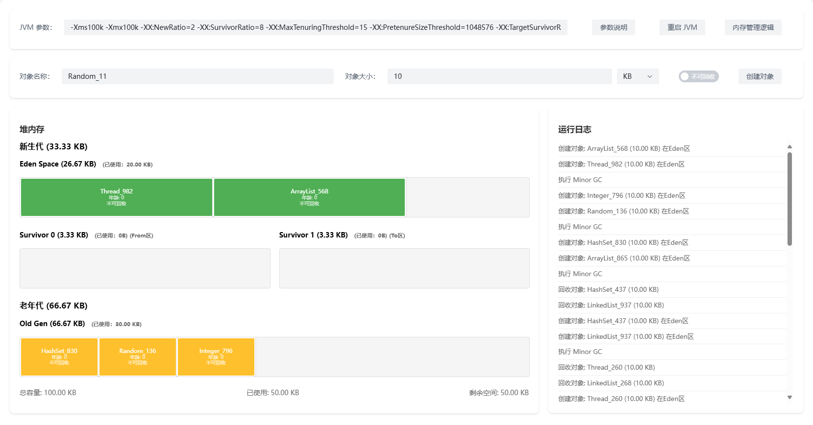

# newbie-jvm-playground

从字节码到 GC：可交互的 JVM 全流程仿真实验室

## 在线体验

访问地址：[https://null-object-0000.github.io/newbie-jvm-playground/](https://null-object-0000.github.io/newbie-jvm-playground/)

## 运行界面

## 已实现的 HotSpot JVM 内存管理机制

### 内存分配机制

- **Eden 优先分配**：新创建的对象优先在 Eden 区分配内存空间
- **大对象直接进入老年代**：当对象大小超过 PretenureSizeThreshold 阈值时，直接在老年代分配内存

### 对象晋升机制

- **动态年龄判定**：根据 TargetSurvivorRatio 参数，当 Survivor 区中相同年龄对象大小总和超过 Survivor 区目标使用率时，年龄大于等于该年龄的对象直接进入老年代
- **对象年龄阈值**：通过 MaxTenuringThreshold 参数控制对象在 Survivor 区的最大年龄，超过该阈值的对象将晋升至老年代

### GC 触发机制

- **Minor GC 触发条件**：当 Eden 区空间不足时自动触发
- **Minor GC 执行流程**：
  - 扫描 Eden 区和 From Survivor 区的存活对象
  - 将存活对象复制到 To Survivor 区或老年代
  - 清空 Eden 区和 From Survivor 区
  - 交换 From Survivor 和 To Survivor 区的角色

以上机制均可通过可视化界面进行交互式操作，帮助理解 JVM 内存管理的工作原理。